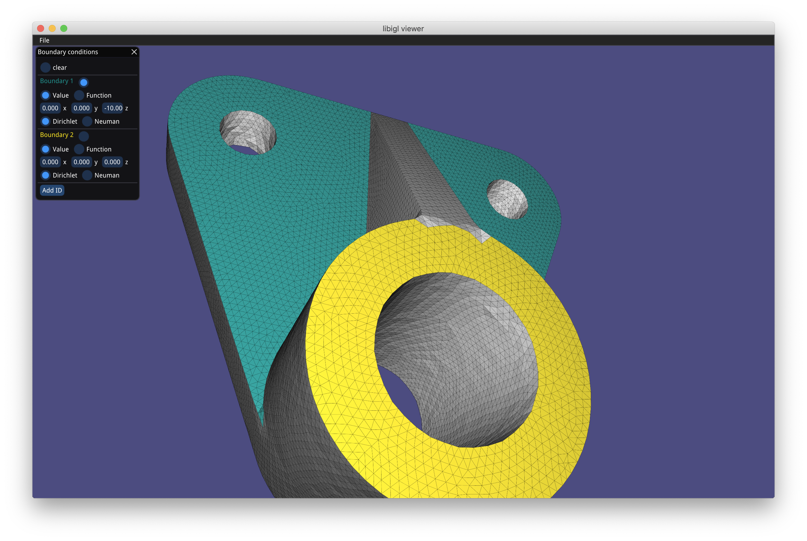
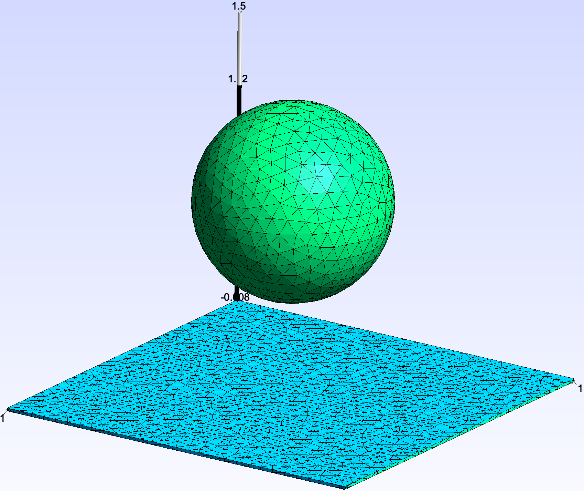
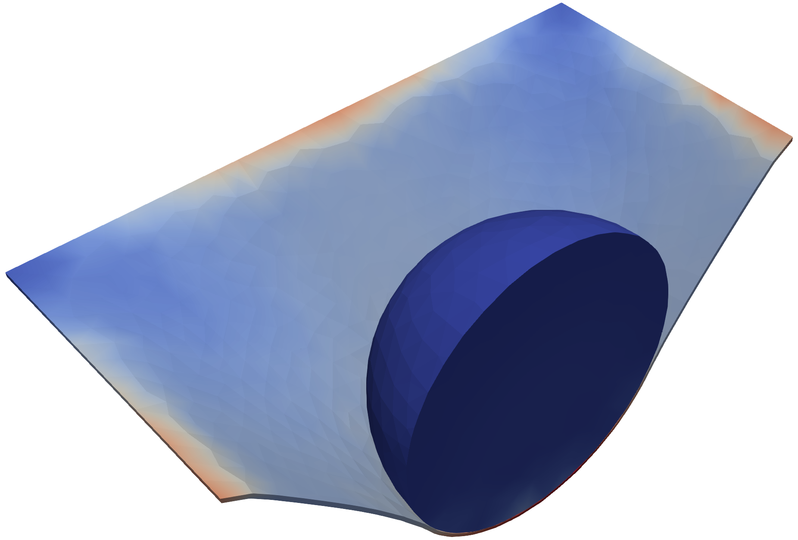
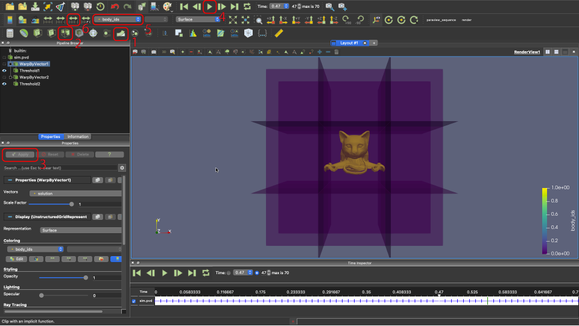

# Getting Started

## A First-Example: Solving the Laplacian on a Plate-Hole Mesh

[Here](../img/plate_hole.obj) you can find the *plate with hole* mesh used in this tutorial.

| Mesh | Solution |
| --- | --- |
|  |  |

To setup and run this simulation create a JSON file (for example, `run.json`) containing the following:

```json
{
    "geometry": {
        "advanced": {
            "normalize_mesh": true
        },
        "mesh": "plate_hole.obj",
        "surface_selection": {
            "threshold": 1e-07
        }
    },

    "materials": {
        "type": "Laplacian"
    },

    "output": {
        "json": "stats.json",
        "paraview": {
            "file_name": "<result.vtu>"
        }
    },

    "preset_problem": {
        "type": "Franke"
    },

    "solver": {
        "linear": {
            "solver": "Eigen::SparseLU"
        }
    }
}
```

Then run `PolyFEM_bin --json run.json`.

Refer to the [JSON API](../../json) for a the full description of JSON parameters.

Boundary Conditions
-------------------

PolyFEM uses boundary tags to mark boundary primitives (edges in 2D and faces in 3D). By default:

- in 2D all edges whose barycenter is close up to 1e-7 to the left side of the bounding box get the tag 1, the right side gets 3, bottom 2, and top 4. Any other boundary gets 7.
- in 3D the threshold is a bit larger (1e-2) and x-direction gets 1, 3, y-direction gets 2, 4, and z-direction gets 5, 6. Any other boundary gets 7.

You can also specify a file containing a list of integers per each edge/face of the mesh indicating the tag in the JSON.

If you want to run the *real* plate-with-hole problem, set the correct Lamé constants in `"materials"`, and specify the proper boundary conditions in `"boundary_conditions"`. For this example, we want Neumann boundary condition of `[100, 0]` (a force of 100 in $x$) applied to the whole right side (pulling), so in the `"neumann_boundary"` array of `"boundary_conditions"`, we add an entry with `"id": 3` and `"value": [100, 0]`.
For the two Dirichlet, it is a bit more complicated because we want reflective boundary conditions, that is we want to fix only one of the two coordinates. For instance, the right part of the mesh (`"id": 1`) needs to be fixed in $x$ (or equivalent can move only in $y$-direction). To do so we add an entry to the `"dirichlet_boundary"` array with `"id": 1` and `"value": [0, 0]`, that is zero displacements, and specify which `"dimension"` these boundaries need to be applied, in this case, only the $x$-direction so `"dimension"` gets the value `[true, false]`. Similarly, the top part (`"id": 4`) gets `"dimension": [false, true]`.


```json
{
    "materials": {
        "type": "LinearElasticity",
        "E": 210000,
        "nu": 0.3
    },

    "boundary_conditions": {
        "neumann_boundary": [{
            "id": 3,
            "value": [100, 0]
        }],

        "dirichlet_boundary": [{
            "id": 1,
            "value": [0.0, 0.0],
            "dimension": [true, false]
        }, {
            "id": 4,
            "dimension": [false, true],
            "value": [0.0, 0.0]
        }]
    }
}
```

### Spatially Varying Boundary Conditions

The specified value for boundary conditions can also contain expressions as strings depending on `x`,`y`, and `z`. PolyFEM will evaluate these expressions on the edge/face. For this, we use the [TinyExpr](https://github.com/codeplea/tinyexpr) library.

In addition to [TinyExpr's built-in functions](https://github.com/codeplea/tinyexpr#functions-supported), we define some useful utility functions including:

* `min(a, b)`: minimum of two values
* `max(a, b)`: maximum of two values
* `if(cond, a, b)`: if `cond` $\ge$ 0, return `a`, otherwise return `b`
* `sign(x)`: 1 if $x > 0$, 0 if $x == 0$, and -1 if $x < 0$
* `deg2rad(d)`: convert degrees to radians
* `rotate_2D_x(x, y, theta)`: given a value for `x`, `y`, and `theta`, compute the *x* component of a 2D rotation of `theta` radians
    * definition: $x\cos(\theta) - y\sin(\theta)$
* `rotate_2D_y(x, y, theta)`: given a value for `x`, `y`, and `theta`, compute the *y* component of a 2D rotation of `theta` radians
    * definition: $x\sin(\theta) + y\cos(\theta)$
* `smooth_abs(x, k)`: a smooth approximation to `abs(x)`
    * definition: $\tanh(kx)x$

### BC Setter App

Since creating the file with association from boundary to ID is complicated, we also provide an application `bc_setter` to interactively *color* faces of 3D meshes (or edges of 2D meshes) and associate tags.

By *shift*-clicking you can color coplanar faces to assign an ID (*command* or *control*-click colors only one face). The UI also allows specifying the three values (for scalar problem only one) to assign to that boundary condition and choose between Dirichlet and Neumann.

On save, it will produce the `.txt` file with the tags to be used in the `"surface_selection"` JSON field and a JSON file to set the `"boundary_conditions"`.



Time-Dependent Simulation
-------------------------

To enable time-dependent simulation add
``` json
"time": {
    "tend": 1,
    "dt": 0.1
}
```
to the root of the JSON. The duration of the simulation is specified as `"tend"` and the number of time steps can either be set directly using `"time_steps"` or by specifying the time step size `"dt"` (`"dt"` has priority over `"time_steps"`).

You can also specify the time integration method using
```json
"time": {
    "integrator": "ImplicitEuler"
}
```
By default it uses `"ImplicitEuler"`, and a complete list of options can be found [here](../../details/time_integrators) along with details about other time parameters.

When doing time-dependent simulation PolyFEM will generate a sequence of VTU files (one file per time step) and a [PVD](https://www.paraview.org/Wiki/ParaView/Data_formats#PVD_File_Format) file of the animation that can be directly viewed in [ParaView](https://www.paraview.org/). You can change the name of this PVD file

### Time-Dependent Boundary Conditions

Enabling time-dependent simulation also enables the ability to use the current time to design time-dependent boundary conditions. To define time-dependent boundary conditions you can use the variable `t` in an expression value. For example,
```json
"dirichlet_boundary": [{
    "id": 1,
    "value": ["t", 0, 0]
}]
```
defines a boundary condition that linearly increases in the x component as time progresses. An example use case for this would be in an elasticity problem to move the boundary over time (remember in this case the value expresses the displacement, not the position).

Selections, Multi-material, and Collisions
------------------------------------------



PolyFEM supports multi-material and contact.

For example, here we show how to simulate a sphere of radius 0.5 m centered at $[0,1,0]$ with material $E=10^8, \nu=0.4, \rho=2000$ falling on thin soft mat ($E=10^6, \nu=0.4, \rho=1000$) we need to set the body id.

First, we need to specify the geometry and assign ids to the surface and volume.
To do this add this to the main JSON file:

```json
"geometry": [{
    "mesh": "../../../meshes/3D/simple/sphere/sphere1K.msh",
    "transformation": {
        "translation": [0, 1, 0]
    },
    "volume_selection": 1
}, {
    "mesh": "../../../meshes/3D/simple/mat/mat40x40.msh",
    "transformation": {
        "scale": 2
    },
    "volume_selection": 2,
    "surface_selection": [{
        "id": 1,
        "axis": "-x",
        "position": -1
    }, {
        "id": 2,
        "axis": "x",
        "position": 1
    }]
}],
```

The sphere will be given a volume ID of 1 and the mat will get ID 2. An axis-plane selection is used can be used to set the surface IDs. Here the faces with a barycenter left of $x=-1$ are given a surface ID of 1 and the faces with barycenters right of $x=1$ will be given an ID of 2.

Next, we need to associate materials and boundary conditions with these IDs. We set the boundary conditions by adding the following to the JSON:
```json
"materials": [{
    "id": 1,
    "E": 1e8,
    "nu": 0.4,
    "rho": 2000,
    "type": "NeoHookean"
}, {
    "id": 2,
    "E": 1e6,
    "nu": 0.4,
    "rho": 1000,
    "type": "NeoHookean"
}]
```
This sets the sphere to a stiff NeoHooean material ($E=10^8, \nu=0.4, \rho=2000$) and the mat to a softer NeoHookean material ($E=10^6, \nu=0.4, \rho=1000$).

We specify boundary conditions and `"rhs"` (for the gravity) as:
```json
"boundary_conditions": {
    "rhs": [0, 9.81, 0],
    "dirichlet_boundary": [{
        "id": 1,
        "value": ["-min(t,0.28)", 0, 0]
    }, {
        "id": 2,
        "value": ["min(t,0.28)", 0, 0]
    }]
}
```
Here the mat is given a Dirichlet boundary condition for the left selection to stretch it to the left and the right selection to stretch it to the right.

Since this is a contact problem we need to enable collision, **no other thing is needed**: `"contact": {"enabled": true}`, and run the simulation (the complete JSON script can be found [here](https://github.com/polyfem/polyfem-data/blob/397d67ebab70fdf66c2303bf0777f2da07b186d8/contact/examples/3D/large-ratios/sphere-mat.json)).

The final results look like these where we sliced the scene in half to show the internal stresses.


Output
------

The simulation results will be output as a VTU file or a sequence of VTU files and a PVD file for the time sequence.

### Visualizing Results using ParaView

Here are some tips for working with the output in ParaView.



1. Warp: if the solution is displacements, apply the displacements to the rest mesh
2. Filter: filter elements by a field (here by `body_ids` to set the opacity of the box separately from the Octocat)
3. Apply settings: apply the setting changes (there is a ParaView setting to automatically do this)
4. Play: play the time sequence
5. Input fields: select the field to visualize
6. Rescale over all timesteps: rescale the colors to fit the range of all values over time
