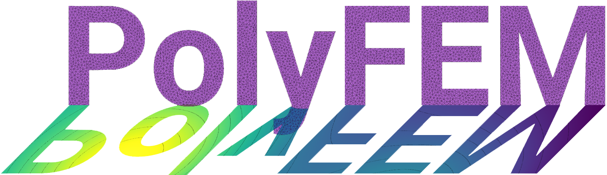

PolyFEM
=======

*A polyvalent C++ and Python FEM library.*




PolyFEM is a simple C++ and Python finite element library. We provide a wide set of common PDEs including:

 - Laplace
 - Helmholtz
 - Linear Elasticity
 - St. Venant–Kirchhoff Elasticity
 - Neo-Hookean Elasticity
 - Stokes
 - Navier–Stokes

PolyFEM simplicity lies in the interface: just pick a problem, select some boundary condition, and solve. No need to construct complicated function spaces, or learn a new scripting language: everything is set-up trough a [JSON interface](json.md) or through the [Setting class](polyfempy_doc.md) in python.


For instance, PolyFEM seamlessly integrates quad/hexes and tri/tets of order up to 4, and integrates state-of-the-art techniques such as the adaptive $p$-refinement presented in "Decoupling Simulation Accuracy from Mesh Quality" or the spline and polygonal bases in "Poly-Spline Finite-Element Method".

The library is actively used in our research so expect frequent updates, fixes, and new features!

News
----

- New "selection" interface to set boundary conditions and body ids.
- Added support for multi-material simulations.
- PolyFEM supports time-dependent fluid simulations!
- PolyFEM supports contacts using the [IPC Toolkit](https://github.com/ipc-sim/ipc-toolkit).
- We support FEBio (*.feb) files.
- We finally extracted the solvers from PolyFEM. You can now use the wrappers independently, check the [PolySolve repo](https://github.com/polyfem/polysolve).
- PolyFEM [meshplot](https://skoch9.github.io/meshplot), [igl](https://libigl.github.io/) and [wildmeshing](https://wildmeshing.github.io/) are presented at a [Eurographics course](https://geometryprocessing.github.io/blackbox-computing-python/).
- Bindings v0.5.2 with a new more pythonic interface, support for functions of the right-hand side and exact solution.
- PolyFEM is being used in biology! Check the [paper](https://pubs.acs.org/doi/10.1021/acs.nanolett.9b01505) or the [project page](https://cellogram.github.io)!
- PolyFEM [meshplot](https://skoch9.github.io/meshplot), [igl](https://libigl.github.io/) and [wildmeshing](https://wildmeshing.github.io/) are presented at a [SIGGRAPH course](https://geometryprocessing.github.io/geometric-computing-python/) (07/30/2019).
- PolyFEM is now triangle and tetgen free. Stay tuned for the release of v0.5 in python with a new interface to high-order meshes and [meshplot](https://skoch9.github.io/meshplot) for the fast 3D plots!
- PolyFEM has been used in "A Large Scale Comparison of Tetrahedral and Hexahedral Elements for Finite Element Analysis"! Check the [interactive plots](https://polyfem.github.io/tet-vs-hex/plot.html)!
- PolyFEM now supports high-order geometric maps! Check the SIGGRAPH paper "TriWild: Robust Triangulation with Curve Constraints" for more details!
- PolyFEM has a [python interface](python.md)!
- PolyFEM can do adaptive *a priori* $p$-refinement! Check the SIGGRAPH paper "Decoupling Simulation Accuracy from Mesh Quality" for more details!

PolyFEM in C++
----


For more details refer to the [C++ section](cxx_index.md)


### Compilation

All the C++ dependencies required to build the code are included. It should work on Windows, macOS, and Linux, and it should build out-of-the-box with CMake:

```sh
mkdir build
cd build
cmake ..
make -j4
```

### Usage

The main executable, `./PolyFEM_bin`, can be called as a command-line interface. Simply run:

```sh
./PolyFEM_bin --help
```

PolyFEM in Python
------

[](https://anaconda.org/conda-forge/polyfempy)
[](https://anaconda.org/conda-forge/polyfempy)
[](https://anaconda.org/conda-forge/polyfempy)
[](https://mybinder.org/v2/gh/polyfem/polyfem.github.io.git/docs?filepath=docs%2Fpython_examples.ipynb)

For more details refer to the [Python section](python.md)

### Installation

We are making efforts to provide a simple python interface to Polyfem.

For doing so, we are maintaining a *conda* package that can be easily installed [https://anaconda.org/conda-forge/polyfempy](https://anaconda.org/conda-forge/polyfempy).

```sh
conda install -c conda-forge polyfempy
```

### Usage
Simply import the package!

```python
import polyfempy
```

PolySolve
---------

PolyFEM heavily depends on external libraries for solving linear systems. If you need a linear system wrapper based on Eigen (but do not need the finite element setup) you use [PolySolve](polysolve.md).

Citation
--------

If you use PolyFEM in your project, please consider citing our work:

```bibtex
@misc{polyfem,
  author = {Teseo Schneider and Jérémie Dumas and Xifeng Gao and Denis Zorin and Daniele Panozzo},
  title = {{PolyFEM}},
  howpublished = "\url{https://polyfem.github.io/}",
  year = {2019},
}
```

```bibtex
@article{Schneider:2019:PFM,
  author = {Schneider, Teseo and Dumas, J{\'e}r{\'e}mie and Gao, Xifeng and Botsch, Mario and Panozzo, Daniele and Zorin, Denis},
  title = {Poly-Spline Finite-Element Method},
  journal = {ACM Trans. Graph.},
  volume = {38},
  number = {3},
  month = mar,
  year = {2019},
  url = {http://doi.acm.org/10.1145/3313797},
  publisher = {ACM}
}
```

```bibtex
@article{Schneider:2018:DSA,
    author = {Teseo Schneider and Yixin Hu and Jérémie Dumas and Xifeng Gao and Daniele Panozzo and Denis Zorin},
    journal = {ACM Transactions on Graphics},
    link = {},
    month = {10},
    number = {6},
    publisher = {Association for Computing Machinery (ACM)},
    title = {Decoupling Simulation Accuracy from Mesh Quality},
    volume = {37},
    year = {2018}
}
```

Acknowledgments & Funding
--------
The software is being developed in the [Geometric Computing Lab](https://cims.nyu.edu/gcl/index.html) at NYU Courant Institute of Mathematical Sciences and the University of Victoria, Canada.


This work was partially supported by:

* the NSF CAREER award 1652515
* the NSF grant IIS-1320635
* the NSF grant DMS-1436591
* the NSF grant 1835712
* the SNSF grant P2TIP2_175859
* the NSERC grant RGPIN-2021-03707
* the NSERC grant DGECR-2021-00461
* Adobe Research
* nTopology


License
-------

The code of PolyFEM itself is licensed under [MIT License](https://github.com/polyfem/polyfem/blob/main/LICENSE). However, please be mindful of third-party libraries which are used by PolyFEM and may be available under a different license.
