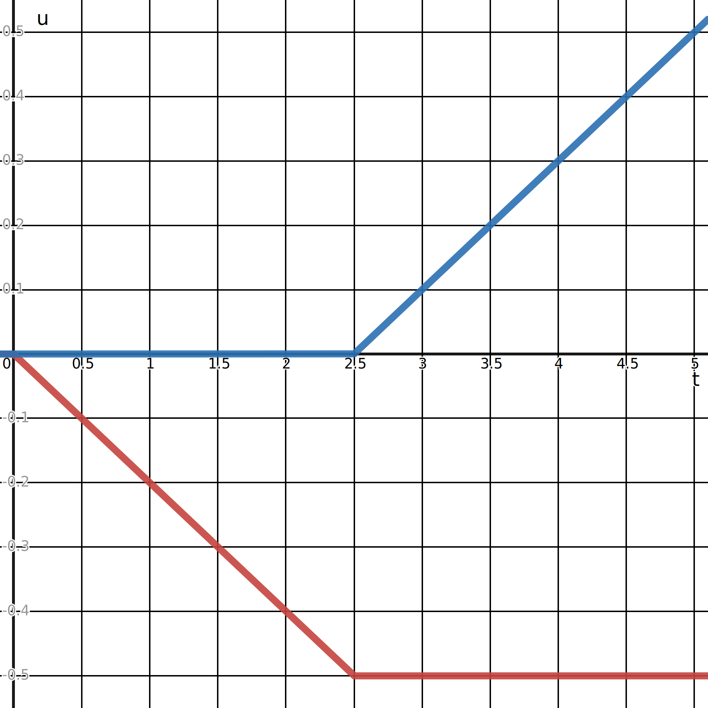

# IPC Quick Start Guide

<div class="md-source-date"><small>Author: Zachary Ferguson</small></div>

!!! note
    This is a retelling of the original [IPC Quick Start Guide](https://github.com/ipc-sim/IPC/wiki) from the original IPC codebase.

## Setup

The first step is to clone and build PolyFEM (see [here](../../cxx_index.md) for instructions). This will create the `PolyFEM_bin` executable that we will use to run the examples. To run an example you can use the following command:

```bash
./PolyFEM_bin -j <path/to/example.json> -o <path/to/output/dir>
```

You can also use the `--help` flag to see all the available options.

<!-- We will assume all the example JSON files are in a directory `tutorial`. -->

All files used in this tutorial can be found [here](https://github.com/polyfem/polyfem.github.io/tree/docs/docs/tutorials/ipc_quick_start_guide/input).

### IPC Default Parameters

Since many of the default parameters in PolyFEM differ from those in the original IPC codebase, we provide a JSON file [`ipc-defaults.json`](input/ipc-defaults.json) which maps the default parameter values from IPC to their equivalent parameters in PolyFEM. This file is then included in all the example JSON files using `"common": "ipc-defaults.json"`.

!!! todo
    Describe what each of the default parameters controls.

## Hello, World!

Let us start with a "Hello, World!" example of two cubes falling onto a ground plane.

The input JSON for this scene can be found at [`2-cubes-falling.json`](input/2-cubes-falling.json). To run this example, use the following command:

```bash
./PolyFEM_bin -j 2-cubes-falling.json -o 2-cubes-falling
```

This will create a directory `2-cubes-falling` with the following files:

```
$ ls 2-cubes-falling
sim.pvd step_0.vtm step_0.vtu [...] step_200.vtm step_200.vtu
```

We can open the PVD file using [ParaView](https://www.paraview.org/) and play the animation to visualize the simulation:

<video loop muted controls>
<source src="../videos/2-cubes-falling.mp4" type="video/mp4">
</video>

!!! tip
    In ParaView, make sure to press the WarpByVector  button to see the deformed animation. Otherwise, you will only see the undeformed rest mesh.

---

Let’s take a look at the input JSON file [`2-cubes-falling.json`](input/2-cubes-falling.json):

```json

```

The config is simple:

* `"common"`: this includes the default IPC parameters from the `ipc-defaults.json` file.
* `"geometry"`: the geometry of the scene comprised of two cubes and a ground plane.
    * `"mesh"`: the path to the mesh file (a tetrahedral mesh `cube.msh` for the cubes and a triangular mesh `plane.obj` for the ground plane).
    * `"transformation"`: transform the input mesh before running the simulation.
        * `"translation"`: translate the first cube up by 3 units and the second cube up by 1 unit.
    * `"volume_selection"`: assigns an ID to the volume (uniformly) which we will use later.
    * `"is_obstacle"`: specify that the ground plane is a static obstacle.
        * Obstacles are non-simulated geometries with prescribed displacements (here default to zero).
* `"contact"`: parameters for the contact model
    * `"friction_coefficient"`: coefficient of friction for all contacts.

## Physical Materials and Time Steppers

Now let’s make some changes to the hello world script to make the simulation more interesting.

### Stiffer Material

The default material parameters in `ipc-default.json` are:

```json
"materials": {
    "type": "NeoHookean",
    "E": 1e5,
    "nu": 0.4,
    "rho": 1000
}
```

This corresponds to a NeoHookean material with Young’s modulus $E = 10^5~\text{Pa}$, Poisson’s ratio $\nu = 0.4$, and density $\rho = 1000~\frac{\text{kg}}{\text{m}^3}$.

We can change these parameters for all objects in the scene by changing Young's modulus to $10^6~\text{Pa}$:

```json

```

!!! note
    Notice that we changed the `"common"` parameter to point to the starting example `2-cubes-falling.json`. This means our changes in this file will be applied on top of the changes in the starting example (which also are applied on top of the default parameters in `ipc-defaults.json`).

This will make Young’s modulus 10x larger than the default while keeping density and Poisson’s ratio the same. Let’s see what we get:

<video loop muted controls>
<source src="../videos/stiffer.mp4" type="video/mp4">
</video>

Yes! The boxes are stiffer now.

### Multiple Materials

We can also set different materials for different objects:

```json

```

We replace our single `"materials"` object with a list of objects with `"id"` keys. These IDs correspond to the `"volume_selection"` from earlier. In general, `"volume_selection"` allows us to select a subset of the mesh's elements and assign a volume ID to them. In this case, we assign a uniform ID to all elements in the cube mesh. Where the first cube gets an ID of 1 and the second gets an ID of 2. We then use these volume IDs to assign different materials to each cube. The first cube gets a material that is 3× heavier and 1000× stiffer. While the second cube gets the original material.

<video loop muted controls>
<source src="../videos/heavy-top.mp4" type="video/mp4">
</video>

Here we rendered softer material with a light yellow color. As we see the top box is nearly rigid now and the bottom box deforms more. Even with this super stiff material PolyFEM stays robust and accurate.

### Simulation Time and Time Step Size

Following the default in IPC, we have been simulating the scene for 5 seconds with a time step size of 0.025s, generating 200 frames.

#### Smaller Time Step Sizes

One option to get more energetic animation (while sticking with implicit Euler stepping -- see also Newmark stepping below) is to apply smaller time step sizes to reduce the numerical damping of implicit Euler time integration:

```json

```

The `"time"` parameter here controls time step size `"dt": 0.005`, which results in a more energetic animation:

<video loop muted controls>
<source src="../videos/smaller-dt.mp4" type="video/mp4">
</video>

#### Larger Time Step Sizes (Nearly Quasi-Static)

One of the exciting features of IPC and PolyFEM is that it is robust enough to support extremely large time step sizes on the order of seconds with implicit Euler. In turn, this enables rapid solutions of equilibrium conditions subject to contact, friction and large deformation (via nearly quasi-static solves under numerical damping). For a simple demonstration, we can simulate our hello world example with $\Delta t = 1~\text{s}$:

```json

```

The animation now is composed of only five frames, one for each second. As we see numerical damping is so large that the cubes are barely bouncing.

<video loop muted controls>
<source src="../videos/larger-dt.mp4" type="video/mp4">
</video>

## Initial Velocity

To set nonzero initial velocities for objects, we need to specify them as `"initial_conditions"`.

### Initial Linear Velocity

For example, we can set the initial velocity of the top cube to be $-20~\frac{\text{m}}{\text{s}}$ in the y direction:

```json

```

Again here we are using the volume IDs to select the top cube.

<video loop muted controls>
<source src="../videos/initial-linear-velocity.mp4" type="video/mp4">
</video>

Even for this high-speed impact scene, PolyFEM stays robust and accurate without numerical instabilities or explosions.

### Initial Angular Velocity

Instead of using a constant value for the initial velocity, we can use a tiny expression dependent on the positions.

We can specify an initial angular velocity by computing

$$
\begin{bmatrix}\omega_x & \omega_y & \omega_z\end{bmatrix}
\times
\begin{bmatrix}x & y & z\end{bmatrix}
$$

where $\omega_{\{x, y, z\}}$ are the angular velocity in radians and $x$, $y$, and $z$ are the positions to be evaluated at.

!!! note
    This assumes the center of rotation is at the origin. If you want to rotate around a different point, you need to translate the positions to the origin first.

For example, if we want to rotate the top cube 90 degrees/second around the y-axis, then we compute the initial velocity as

$$
\begin{bmatrix}0 & \frac{\pi}{2} & 0\end{bmatrix}
\times
\begin{bmatrix}x & y & z\end{bmatrix}
=
\begin{bmatrix}\frac{\pi}{2}z & 0 & -\frac{\pi}{2}x\end{bmatrix}
$$

In the JSON we encode this as a string containing the expression:

```json

```

and voila now the top cube is spinning!

<video loop muted controls>
<source src="../videos/initial-angular-velocity.mp4" type="video/mp4">
</video>

## Collision Obstacles

In many simulations we want to script the motion of certain objects, the best way to do this is to specify the object as an obstacle and then specify the prescribed displacement.

### Translation

To make the second code an obstacle all we need to do is set `"is_obstacle": true`.
Then we can specify the displacement of this obstacle using the `"boundary_conditions/obstacle_displacements"` field:

```json

```

Notice that we changed the `"volume_selection"` to `"surface_selection"` because we need to identify the surface on which the boundary conditions apply.

We set the obstacle's displacement to `["t", "t", "t"]` which means the obstacle will translate with a velocity of $[1, 1, 1]$ m/s.

<video loop muted controls>
<source src="../videos/translating-obstacle.mp4" type="video/mp4">
</video>

### Rotation

Making the second cube rotate is a bit trickier. We can compute the displacement in Euler’s angle representation as

$$
\begin{bmatrix}
\Delta{x} \\ \Delta{y} \\ \Delta{z}
\end{bmatrix}
=
R_x(\omega_x t) R_y(\omega_y t) R_z(\omega_z t)
\left(
\begin{bmatrix}
x \\ y \\ z
\end{bmatrix}
-
\begin{bmatrix}
c_x \\ c_y \\ c_z
\end{bmatrix}
\right)
+
\begin{bmatrix}
c_x \\ c_y \\ c_z
\end{bmatrix}
-
\begin{bmatrix}
x \\ y \\ z
\end{bmatrix}
$$

where $\Delta\{x,y,z\}$ are the obstacle displacement, $\omega_{\{x,y,z\}}$ are the angular velocities, $c_{\{x,y,z\}}$ is the center of rotation, $R_{\{x,y,z\}}$ are the axis-aligned rotation matrices, and $x$, $y$, and $z$ are the positions to be evaluated at. Computing this by hand can be annoying, so instead, you can use [this Python notebook](rotating-obstacle.ipynb) to compute the expression.

As an example, here we kinematically rotate the second cube with an angular velocity of $[10, 90, 0]$ degrees/second:

```json

```

<video loop muted controls>
<source src="../videos/rotating-obstacle.mp4" type="video/mp4">
</video>

Here we render obstacles in grey.

### Codimensional Collisions

IPC contact handling is based on distances and so directly supports codimensional (surfaces, edges, points) kinematic collision obstacles!

!!! note
    Currently, PolyFEM does not yet include simulated codimensional materials like shells or rods.

#### Closed Surface

If we script the motion of an object, then for a closed surface the interior tessellation is unnecessary, and we can directly use a surface mesh (`.obj` file)!

```json

```

This is equivalent to using a volumetric mesh because PolyFEM automatically extracts and uses the surface for obstacles.

<video loop muted controls>
<source src="../videos/rotating-obstacle-surface.mp4" type="video/mp4">
</video>

#### Open Surface

This script replaces the cube with a single triangle (zero volume):

```json

```

<video loop muted controls>
<source src="../videos/rotating-obstacle-triangle.mp4" type="video/mp4">
</video>

#### Edges

This script uses the same single triangle but only with its edges. Here we also scale the triangle 2× larger to let the box fall through.

```json

```

The `"extract": "edges"` specifies that only the edges of the triangle mesh should be used.

<video loop muted controls>
<source src="../videos/rotating-obstacle-edges.mp4" type="video/mp4">
</video>

!!! note
    Alternatively, you can load an edge mesh directly by specifying an `.obj` file with line elements. For example, this is the same edge mesh in OBJ format:
    ```
    v -0.5 0 -0.5
    v  0.5 0 -0.5
    v -0.5 0  0.5
    l 1 3
    l 3 2
    l 2 1
    ```

#### Points

Even crazier, this script uses the same single triangle but only with its points. Here we also scale the point cloud 0.7× smaller to let the box hit the points.

```json

```

We use the `"extract": "points"` to only use the points of the triangle.

<video loop muted controls>
<source src="../videos/rotating-obstacle-points.mp4" type="video/mp4">
</video>

!!! note
    Alternatively, you can load a point cloud directly by specifying an `.obj` file with no triangles or edges. For example, this is the same point cloud in OBJ format:
    ```
    v -0.5 0 -0.5
    v  0.5 0 -0.5
    v -0.5 0  0.5
    ```

## Boundary Conditions

### Selection

Similar to how we apply material, to apply boundary conditions we first need to select which nodes to which to apply the boundary conditions using the `"point_selection"` mesh field. Then, we can specify the boundary conditions in the `"boundary_conditions"` field.

```json

```

Let's break down the `"point_selection"` field. The first object
```json
"id": 1,
"box": [
    [0, 0, 0],
    [0.1, 1, 0.1]
],
"relative": true
```
specifies that we should assign an ID of `1` to the nodes in the back left of the mesh. The second object
```json
"id": 2,
"box": [
    [0.9, 0, 0.9],
    [1, 1, 1]
],
"relative": true
```
specifies that we should assign an ID of `2` to the nodes in the front right of the mesh.

The `"box"` parameter specifies a bounding box by minimum and maximum corners in which points are selected. Notice the `"relative": true` field which indicates the box's coordinates are relative to the bounding box of the mesh. If we set `"relative": false` then the coordinates are in world space.

!!! note
    For more information about how to setup boundary conditions (including the more ubiquitous surface selections) look [here](../getting_started.md#boundary-conditions).

### Dirichlet

For a simulated volumetric object, sometimes we script the motion of part of its vertices as Dirichlet boundary conditions. Using our point selections we can specify the boundary conditions as follows:

```json

```

The above script specifies that we should apply a displacement of $[-0.2, 0, -0.2]$ m/s to the nodes with ID `1` and a displacement of $[0.2, 0, 0.2]$ m/s to the nodes with ID `2`. The expressions in strings are evaluated using [TinyExpr](https://github.com/codeplea/tinyexpr). You can find out more about these expressions [here](../getting_started.md#spatially-varying-boundary-conditions) and [here](../getting_started.md#time-dependent-boundary-conditions).

Now let's see what we get:

<video loop muted controls>
<source src="../videos/dirichlet-bcs.mp4" type="video/mp4">
</video>

As we see PolyFEM is robust even when there is large deformation.

What is different here from setting kinematic collision obstacles is that the unselected vertices are still degree-of-freedoms that are simulated. If one selects all vertices of an object by, for example, using a selection of
```json
"point_selection": 1
```
and set them with Dirichlet boundary conditions, it will be essentially identical to a kinematic collision obstacle.

### Neumann

!!! warning
    Nodal Neumann boundary conditions are not yet supported in PolyFEM, so we will setup a similar scene using surface selection.

We can also add extra forces to part of the vertices of simulated volumetric objects in addition to gravity. This can be similarly realized by specifying the `"neumann_boundary"` like how we did for Dirichlet boundary conditions above:

```json

```

Similar to the configuration in our Dirichlet example, the above script applies an a force of $[-2.5 \times 10^4, 0, -2.5  \times 10^4]$ N to the vertices in the left-back and $[2.5 \times 10^4, 0, 2.5  \times 10^4]$ N to the vertices in the right-front:

<video loop muted controls>
<source src="../videos/neumann-bcs.mp4" type="video/mp4">
</video>

!!! note
    Here simulate a hexahedral mesh, but we use a linear triangular mesh for contact handling.
    Additionally, the rendering shows a triangulation of the hexahedral mesh's surface.

Unlike Dirichlet boundary conditions, here the Neumann boundary condition does not restrict the vertical motion of the object, and it elongates the object only to a static state but not further.

### Timed Boundary Conditions

It is also possible to start and stop boundary conditions at a specific time. This can be done by utilizing tiny expressions:

```json

```

Here we apply a displacement of $[-0.2, 0, -0.2]$ m/s to the nodes with ID `1` from time $t=0$ to $t=2.5$ and a displacement of $[0.2, 0, 0.2]$ m/s to the nodes with ID `2` from time $t=2.5$ to $t=\infty$. We can see this if we plot the x/z-displacement of the BC nodes:
<center></center>
where the red line is the displacement of the nodes with ID `1` and the blue line is the displacement of the nodes with ID `2`.

Finally, let's see what we get:

<video loop muted controls>
<source src="../videos/timed-bcs.mp4" type="video/mp4">
</video>

## Advanced Settings

### Input Mesh Sequence

The way of setting kinematic collision obstacles displacements described earlier is expressive but a bit verbose. To support more complex scripting of kinematic collision objects, PolyFEM allows the use of input mesh file sequences.

For example, we can specify a folder path to the kinematic collision objects:

```json

```

In the specified folder `sequence` we provide the mesh files of the triangle wire in each frame as `*.obj`. Note that the input sequence must maintain the correct vertex correspondence to the one throughout the entire sequence.

<video loop muted controls>
<source src="../videos/mesh-sequence.mp4" type="video/mp4">
</video>


<!-- ### Attaching Configuration Initialization -->
### Smaller Distance Initialization

IPC requires a tiny positive gap as it does not support the 0-distance configurations.

The following script sets the upper box in the hello world example right above the lower one:

```json

```

<video loop muted controls>
<source src="../videos/smaller-distance.mp4" type="video/mp4">
</video>

Note the initial gap here is barely visible. In our experience we can set IPC’s contact gap as small as practically needed; i.e., even small enough to fool the ray intersection checks in rendering algorithms.
<!-- Thus rendering of transparent objects with IPC's small gaps can even have artifacts for valid non-intersecting configurations of the contact surfaces (so, for example, to render the IPC “squeeze out” example, we manually set offsets in the renderer despite having physically correct non-intersecting shapes).  -->
Similarly, no two objects can have 0-distance separation : ); even atoms are at distance from each other.

### Newmark Time-Integration

Along with implicit Euler, PolyFEM supports other time integration methods such as implicit Newmark time integration. Implicit Newmark can be applied for improved energy preservation and control. To change the time integrator we can simply set the time integration method.

For example, the following script uses the `time/integrator` key to specify implicit Newmark (`"ImplicitNewmark"`) should be the time integrator for the stiffer boxes scene without friction. By default, `"integrator"` is set to `ImplicitEuler` (backward Euler).

```json

```

Damping can be useful both for predictive or realistic simulation control of damping and also to extend the effective stability of the underlying Newmark time integration method. For example, here we use Rayleigh damping of elasticity:

```json

```

Here we set the damping stiffness as a ratio $\kappa_\text{ratio}$ between 0 and 1. The absolute damping stiffness will be set to $\tfrac{3}{4} \kappa_\text{ratio} \Delta t^3$. If $\kappa_\text{ratio}=1$, at the beginning of time-step Newmark's incremental potential Hessian (with damping term) will be equal to that of implicit Euler. This provides a starting basis for intuitively setting damping stiffness. To alternately directly set damping stiffness use the key `"stiffness"`.

Here in this demo note that we used a smaller time step size at `0.005`s as this is better for the stability of Newmark integration.

| Newmark, `"stiffness_ratio": 0.1` | Newmark, `"stiffness_ratio": 0.2` |
|:-------------------------------:|:-------------------------------:|
| <video loop muted controls><source src="../videos/rayleigh-damping-ratio=0.1.mp4" type="video/mp4"></video> | <video loop muted controls><source src="../videos/rayleigh-damping-ratio=0.2.mp4" type="video/mp4"></video> |
| Newmark, `"stiffness_ratio": 0.4` | Backwards Euler |
| <video loop muted controls><source src="../videos/rayleigh-damping-ratio=0.4.mp4" type="video/mp4"></video> | <video loop muted controls><source src="../videos/backwards-euler.mp4" type="video/mp4"></video> |

### Accuracy Control

#### Time Integration Accuracy

Nonlinear solver accuracy determines how accurate the dynamic time step solve is satisfied. To set the requested nonlinear solver accuracy, we can use the `solver/nonlinear/grad_norm` key to set Newton tolerance on the infinity norm of the Newton increment.

So far, we have used

```json
{
    "solver": {
        "nonlinear": {
            "grad_norm": 1e-05
        }
    }
}
```

The solver will stop once the current Newton increment cannot change any nodal position larger than `1e-5` m even if a full step is taken. Reducing this improves accuracy, but note that the compute cost can then go up.

#### Contact Accuracy

There are three additional accuracies for IPC. Each controls a contact accuracy in IPC: the barrier activation distance (`"dhat"`) which IPC uses to determine if objects are in contact and exert contact forces; the tangent velocity (`"epsv"`) determining where IPC sees the touching objects as not sliding and so exerts static friction forces; and the maximum amount of friction iterations (`"friction_iterations"`) that IPC updates friction tangent and normal forces.

By default PolyFEM uses
```json
{
    "contact": {
        "dhat": 1e-3,
        "epsv": 1e-3
    },
    "solver": {
        "contact": {
            "friction_iterations": 1
        }
    }
}
```

!!! note
    Unlike the original IPC code, these values are **not** scaled by the bounding box size.

The default setting provides a good trade-off between accuracy and efficiency, where there are no visible gaps, no obvious sliding artifacts, or friction force in inaccurate directions.

We can set `"friction_iterations"` set to `-1` to iterate until the tangent operator and normal force converges to obtain even more accurate results. Note that IPC does not guarantee convergence for this case. In practice, for more accurate friction in large deformation or high-speed impact scenes, `"friction_iterations"` at `2`~`4` so far appears generally sufficient.

### Use Your Own Mesh

For collision obstacles (including closed surfaces), one can directly specify the path to their mesh files (`.obj`, `.stl`, `.ply`, etc.) in the script to use it.

For the simulated objects that are tetrahedral meshes, PolyFEM supports [MSH](https://gmsh.info/doc/texinfo/gmsh.html#File-formats) files. PolyFEM supports both ASCII and binary encoded version 2.2 and 4.1 files through the use of [MshIO](https://github.com/qnzhou/MshIO).

To generate a tetrahedral mesh from a triangle mesh, we recommend using [fTetWild](https://github.com/wildmeshing/fTetWild).

### Restarting a Simulation

To learn how to restart a simulation, see [here](../../json.md#restart).

## More Simulation Examples

Hopefully, now you know the basics of how to use IPC within PolyFEM. For more examples, we have set up all the simulations in the original IPC paper (and more!) and you can find them all [here](https://github.com/polyfem/polyfem-data/tree/main/contact/examples).

If you have any further questions, feel free to post an [issue](https://github.com/polyfem/polyfem/issues) on the PolyFEM GitHub repo.
