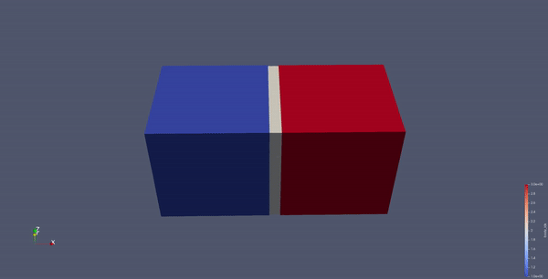
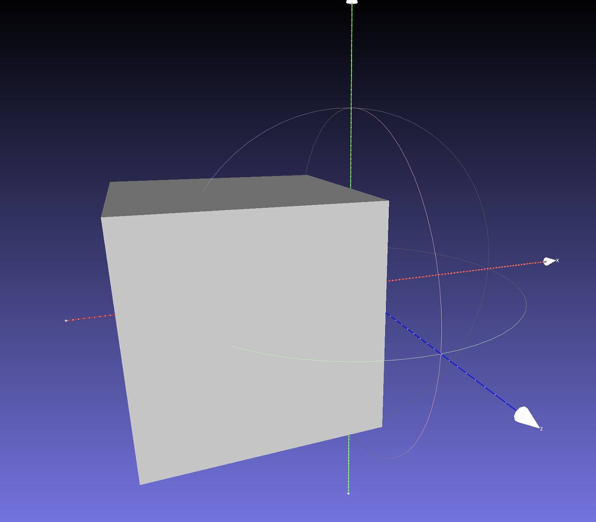
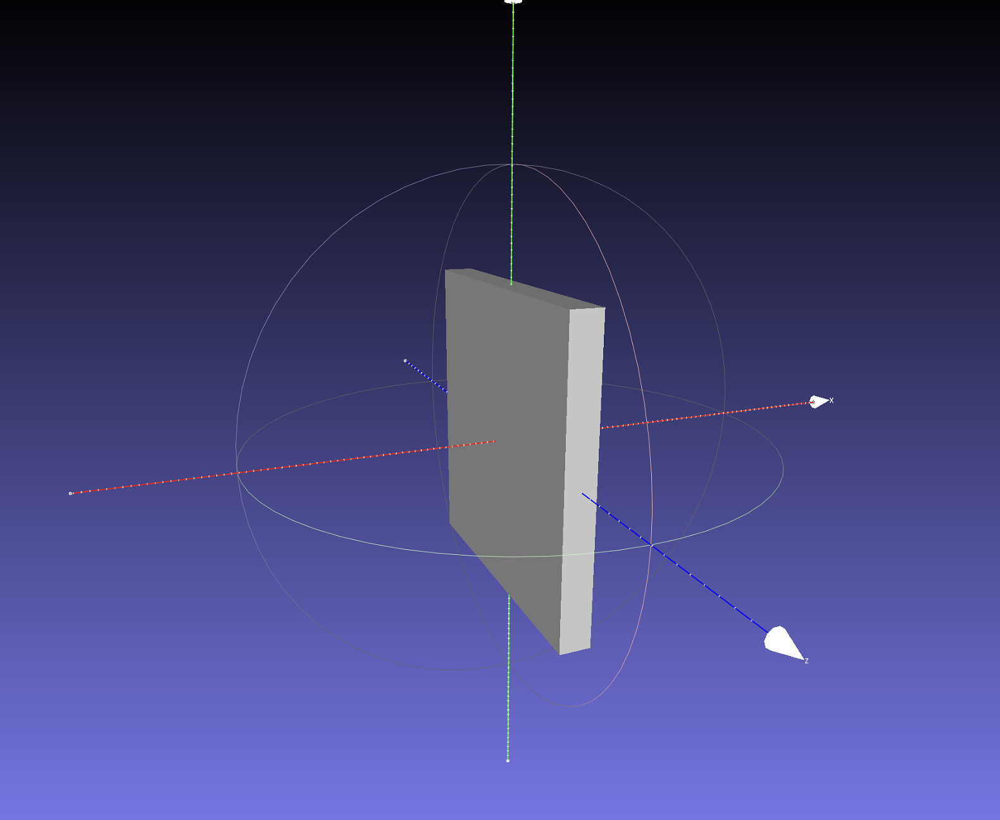
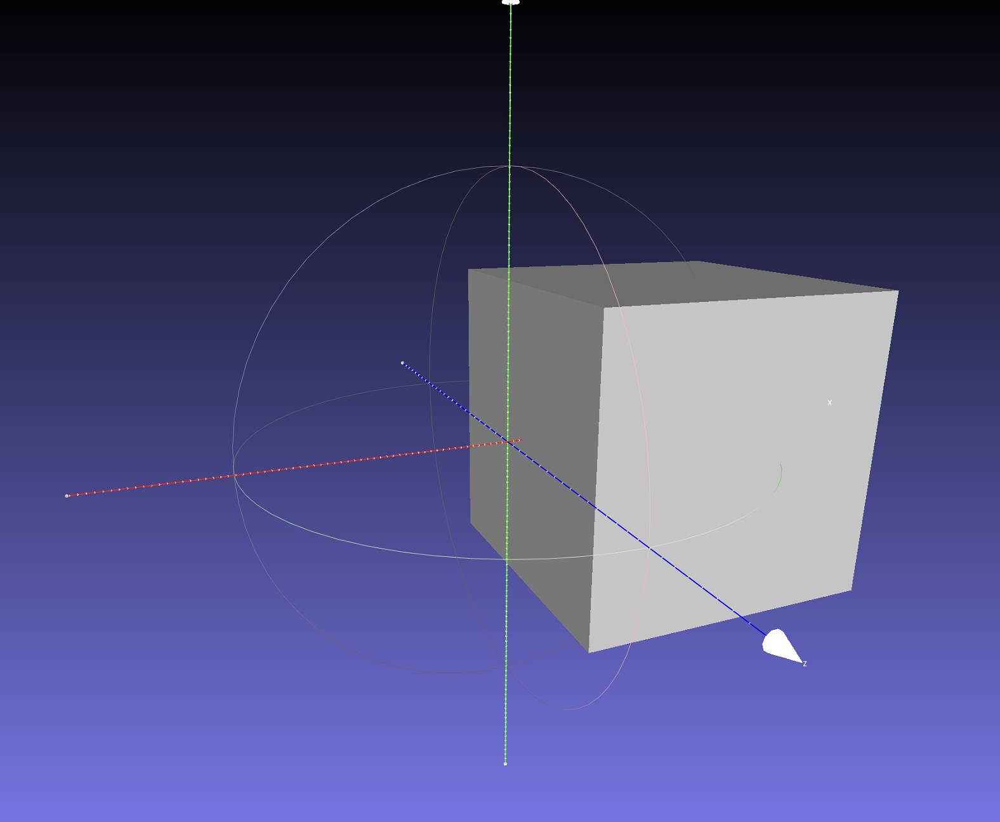
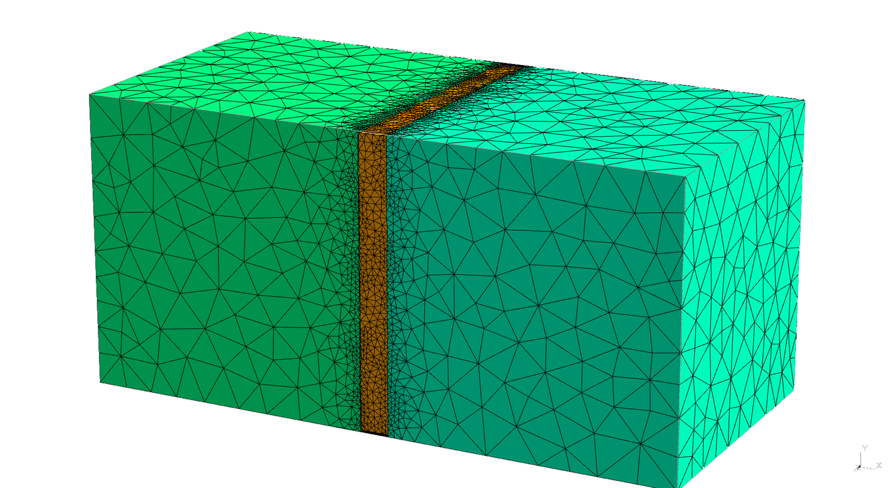

# Simulating Multiple Materials in a Single Mesh

<div class="md-source-date"><small>Author: Zachary Ferguson and Hanwen Zhao</small></div>

<center></center>

In this tutorial, we will demonstrate how to create a multi-material object using [fTetWild](https://github.com/wildmeshing/fTetWild) and simulate it using PolyFEM.

The data for this tutorial can be found [here](https://github.com/polyfem/polyfem-data/tree/main/multi-material).

## Prerequisites

The following items are necessary to complete this tutorial. To replicate the experiment, you can feel free to use either the given mesh files or your own mesh.

- [ ] [Build PolyFEM](../../../cxx_index)
- [ ] [Build fTetwild](https://github.com/wildmeshing/fTetWild)
- [ ] [Download File: left_box.obj](https://github.com/polyfem/polyfem-data/blob/main/multi-material/tetwild/left_box.obj?raw=true)
- [ ] [Download File: middle_box.obj](https://github.com/polyfem/polyfem-data/blob/main/multi-material/tetwild/right_box.obj?raw=true)
- [ ] [Download File: right_box.obj](https://github.com/polyfem/polyfem-data/blob/main/multi-material/tetwild/middle_box.obj?raw=true)
- [ ] [Download File: stretch-cubes.json](https://github.com/polyfem/polyfem-data/blob/main/multi-material/stretch-cubes.json)

### Build PolyFEM

The instructions for building PolyFEM can be found [here](../../../cxx_index). After compilation, to use PolyFEM in any working directory machine, we suggest adding an alias
```shell
alias polyfem='path/to/PolyFEM/build/PolyFEM_bin'
```
to your `~/.bashrc` or `~/.zshrc` file.

Then you can use it by

```shell
polyfem --help
```

### Build fTetWild

You can find the instruction for building fTetWild [here](https://github.com/wildmeshing/fTetWild). After doing so you should have an executable file `FloatTetwild_bin`. For convenience we can again define an alias for this binary:
```shell
alias tetwild='path/to/fTetWild/build/FloatTetwild_bin'
```

## Creating the Mesh

### Input Meshes

We will use three mesh files to create a simple multi-material object: `left_box.obj`, `middle_box.obj`, and `right_box.obj`. The left and right boxes will have nearly rigid material properties, while the middle box will be more flexible.

| Left: `left_box.obj` | Middle: `middle_box.obj` | Right: `right_box.obj` |
| -------------------- | ------------------------ | ---------------------- |
|  |  |  |

### Constructive Solid Geometry

The next step is to create a union of these three meshes, this can be done using [fTetWild](https://github.com/wildmeshing/fTetWild). To create a union of three objects, we can create a JSON file
```json
{
    "operation": "union",
    "left": {
        "operation": "union",
        "left": "left_box.obj",
        "right": "middle_box.obj"
    },
    "right": "right_box.obj"
}
```
and use it as input to fTetWild
```sh
tetwild --csg /path/to/union.json --no-color -o cubes.msh
```

The `--csg` flag stands for [constructive solid geometry](https://en.wikipedia.org/wiki/Constructive_solid_geometry) which describes how to construct a shape using set operations between other shapes (e.g., union, intersection, and difference). In our case, we want to union the three boxes together.

The `--no-color` is optional and disables the color output of fTetWild which can be used to visualize the quality of elements.

The combined mesh should look like this:
<p float="left">

</p>

!!! note
    To view `.msh` files you can use [Gmsh](https://gmsh.info/).

#### Removing Extra Vertices

fTetWild will sometimes produce extra floating vertices that are not part of the mesh. These extra vertices do not harm anything, but can inflate the bounding box making it hard to select a side of the cube in PolyFEM. To remove these vertices we provide a simple Python script [here](https://github.com/polyfem/polyfem-data/blob/main/multi-material/tetwild/remove_tetwild_extra_points.py?raw=true).

## Setting up the Simulation

We will setup the simulation using PolyFEM's JSON interface. For more details, please refer to the [JSON Input](../../../json) documentation.

We will go over the JSON script section by section. The complete JSON file can be found in the [GitHub Repo](https://github.com/polyfem/polyfem-data/blob/main/multi-material/stretch-cubes.json).

### Geometry

```json
{
    "geometry": {
        "mesh": "cubes_v22.msh"
    }
}
```

The `"geometry"` section specifies all required simulation geometry data. The `"mesh"` field defines the path to the volumetric mesh file. In this tutorial, only the `cubes_v22.msh` file from fTetwild will be utilized.

### Boundary Conditions

```json
{
    "boundary_conditions": {
        "rhs": [0, 0, 0],
        "dirichlet_boundary": [{
            "id": 1,
            "value": ["-t", 0, 0]
        }, {
            "id": 3,
            "value": ["t", 0, 0]
        }]
    }
}
```

In `boundary conditions`, we permit the `left box` and `right box` sections to have Dirichlet boundaries that move along the x-axis as a function of time `t`. Here we use the default boundary IDs assigned described [here](../../getting_started/#boundary-conditions).

The `rhs` is defined as `[0, 0, 0]`, which indicates that the simulation has no prescribed body forces (i.e., no gravity).

### Materials

```json
{
    "materials": [{
        "id": 1,
        "E": 2e11,
        "nu": 0.3,
        "rho": 7750,
        "type": "NeoHookean"
    }, {
        "id": 2,
        "E": 2.55e7,
        "nu": 0.48,
        "rho": 1700,
        "type": "NeoHookean"
    }, {
        "id": 3,
        "E": 2e11,
        "nu": 0.3,
        "rho": 7750,
        "type": "NeoHookean"
    }]
}
```

In the `materials` section, we assign identical material properties to the left and right boxes but use a softer material for the middle box.

The volume IDs in this case are loaded directly from the `cubes_v22.msh` file. fTetWild automatically assigns these labels based on which domain the elements falls in the CSG.

!!! warning
    Loading volume IDs from the mesh file is currently only supported with version 4.1 MSH files (both ASCII and binary).

### Time-Dependent Simulation
```json
{
    "time": {
        "dt": 0.0025,
        "time_steps": 20
    }
}
```
In the `"time"` section, we define our time step size as `0.0025` seconds and the total number of steps to be `20`.

### Contact

```json
{
    "contact": {
        "enabled": true,
        "dhat": 0.001
    }
}
```

We enable contact by defining a `"contact"` section as above.

### Solver

```json
{
    "solver": {
        "linear": {
            "solver": "Eigen::PardisoLDLT"
        },
        "nonlinear": {
            "line_search": {
                "method": "backtracking"
            },
            "solver": "newton",
            "grad_norm": 1e-05,
            "use_grad_norm": true
        },
        "advanced": {
            "lump_mass_matrix": true
        }
    }
}
```

We make a few adjustments to the solver. Here we are using Newton with backtracking line-search and `Eigen::PardisoLDLT` for linear solves. We also set the convergence tolerance for the gradient norm to `1e-05`.

### Spatial Discretization

```json
{
    "space": {
        "discr_order": [{
            "id": 1,
            "order": 1
        }, {
            "id": 2,
            "order": 2
        }, {
            "id": 3,
            "order": 1
        }]
    }
}
```

Lastly, we demonstrate that PolyFEM can simulate mixed order elements. In this example, we choose to use linear P1 elements for the left and right box, but use quadratic P2 elements for the middle box.

The use of higher-order representations can lead to more precise calculations with slightly more running time.

## Running the Simulation

We can use the following command to run the simulation:

```sh
polyfem -j stretch-cubes.json -o output/
```

The simulation results will be written to `output/` as a sequence of VTU file and a PVD file for the time sequence.

## Visualize the Simulation Results

To visualize the simulation results in `VTU` format, we can use [`ParaView`](https://www.paraview.org/), an open-source, multi-platform data analysis and visualization application.

To view the results, please follow the instruction below.


* Step 1: `File` - `Open`, select sequence group file step*.vtu or step*.vtm.
* Step 2: Click `Apply` under the tab `Properties` located in the left side of the GUI.
* Step 3: Click on `Wrap By Vector` to apply the displacement to the objects. This function can be found from the top menu bar.
* Step 4: Click again `Apply` under the tab `Properties`.
* Step 5: Now, the `Play` button can be used to view the time sequence results.


