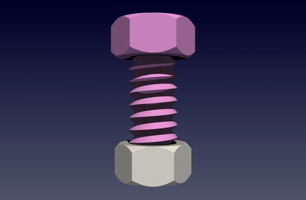
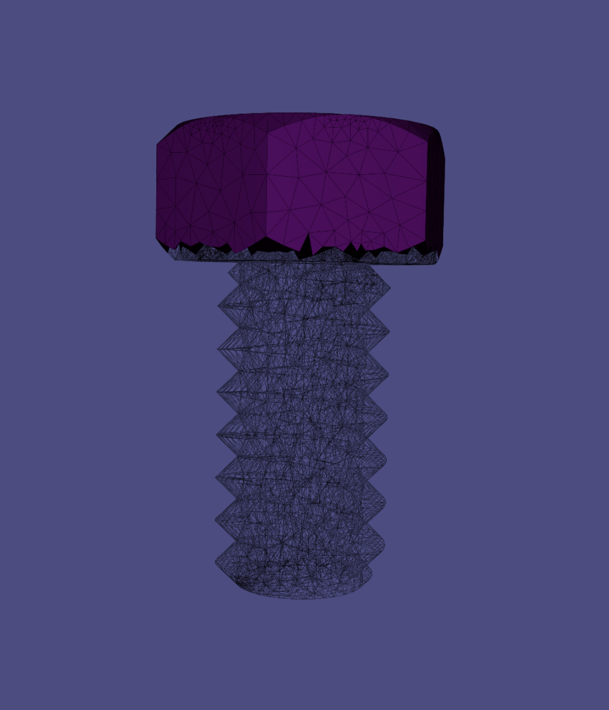
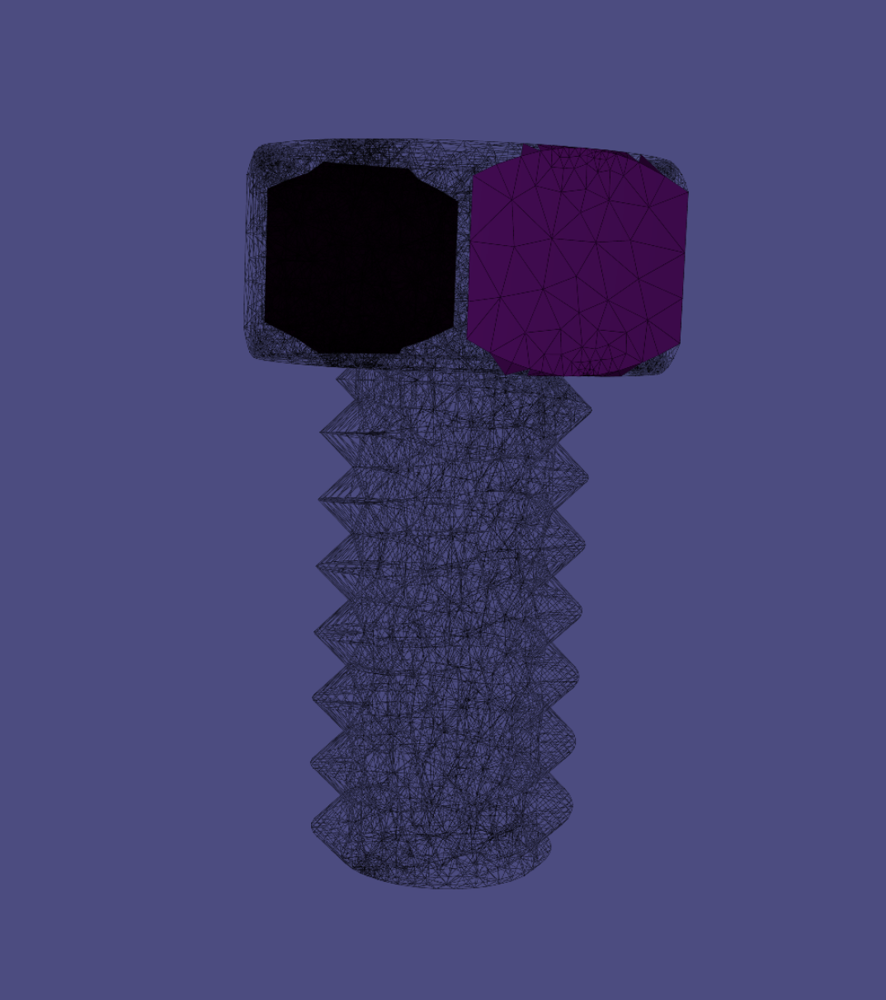

# Screw a Bolt into a Nut

<div class="md-source-date"><small>Author: Duo Zhang</small></div>

This tutorial showcases how to set up and use PolyFEM to simulate screwing a bolt into a nut (for example, to be used in a robotic assembly simulation).

<center></center>

## Prerequisites

In this tutorial, we assume you have already installed PolyFEM on your machine. If not, please follow the instructions [here](../../../cxx_index). After compilation, to use PolyFEM in any working directory machine, we can set up an alias for the main executable for `./PolyFEM_bin` by adding the following to `~/.bashrc` or `~/.zshrc` according to the type of your shell. 

```shell
alias polyfem='path/to/PolyFEM/build/PolyFEM_bin'
```

Then you can use it by 

```shell
polyfem --help
```

### Data Preparation

The data needed in this tutorial can be found [here](https://github.com/KraftOreo/Screw_Polyfem_Tutorial/tree/main/data). The volume mesh files are all made by [fTetWild](https://github.com/wildmeshing/fTetWild). Feel free you make your screws and nuts.

## Overview

In these tutorials, the bolt will be screwed into the nut in several different ways. The tutorials can also be found at [Github: Screw tutorials](https://github.com/KraftOreo/Screw_Polyfem_Tutorial). The screw is represented as a [volume mesh](../../../json/#meshes)

```json
"geometry": [{
    "mesh": "data/screw-big.msh",
    "transformation": {
        "translation": [0, 0, 0],
        "scale": 0.01
	},
	"volume_selection": 1,
	"surface_selection": 2
}]
```

and the nut is set to be an [obstacle](../../../json/#obstacles) just to speed up the simulation by setting `"is_obstacle": true` because obstacles in PolyFEM are rigid and only the surface of obstacles is taken into consideration.

```json
"geometry": [{
    // ...
}, {
    "mesh": "data/nut-big.stl",
    "is_obstacle": true,
    "transformation": {
        "translation": [0, -0.02675, 0],
        "scale": 0.01
    }
}]
```

For other parameters, the bolt is using the parameter of steel

```json
"materials": [{
    "type": "NeoHookean",
    "id": 1,
    "E": 2e11,
    "nu": 0.3,
    "rho": 8050
}]
```

## Fully Constrained Screw in All Dimensions

In this tutorial, the screw is completely controlled by [Dirichlet boundary conditions](../../getting_started/#boundary-conditions) in all three dimensions. Thus the trajectory of the screw is fixed(rotation and transformation) and needs to be calculated carefully. For a single-threaded bolt and every rotation of $360^{\circ}$, the bolt will go into the nut by the thread distance. In this case, the thread distance of the screw used in this tutorial is 1.33m. Therefore the Dirichlet Boundary Condition is set to 

```json
"dirichlet_boundary": [{
    "id": 2,
    "value": [
        "x*cos(-2*pi*t) + z * sin(-2*pi*t)-x",
        "-1.33*0.01*t", 
        "-1*x*sin(-2*pi*t) + z * cos(-2*pi*t)-z"
    ],
    "dimension": [true, true, true]
}]
```

Here the angular velocity of the rotation is $-2\pi$ and the bolt is getting into the nut along the y-axis by $1.33\times 0.01$ since the bolt and the nut is scaled by 0.01. The `"dimension"` argument is set to be true for all three dimensions to make sure the bolt is in full control.

To view the whole JSON file for this case, please go to [screw.json](https://github.com/KraftOreo/Screw_Polyfem_Tutorial/blob/main/screw.json).

To run this JSON with PolyFEM, please go to the GitHub repo [Github: Screw tutorials](https://github.com/KraftOreo/Screw_Polyfem_Tutorial) and run the following in your terminal

```shell
polyfem --json screws.json --output_dir results
```

## Constrained Rotation but Free Movement in the Direction of Feed

In this tutorial, only two dimensions have [Dirichlet boundary conditions](../../getting_started/#boundary-conditions). For the y-axis or the direction of feed, the screw is completely free. Therefore we only need to specify the rotation in the Dirichlet boundary condition and the bolt would get into the nut by basic high school physics.

```json
"dirichlet_boundary": [{
    "id": 2,
    "value": [
        "x*cos(-2*pi*t) + z * sin(-2*pi*t)-x",
        "-1.33*0.01*t", 
        "-1*x*sin(-2*pi*t) + z * cos(-2*pi*t)-z"
    ],
    "dimension": [true, false, true]
}]
```

The only thing we need to modify in the `"dirichlet_boundary"` argument is to change the y-axis in `"dimension"` to false.

## Top Constrained Bolt

Instead of putting [Dirichlet boundary conditions](../../getting_started/#boundary-conditions) on the whole bolt, we can also constrain only the top of the bolt to simulate some actuators. The following image is the visualization of the bolt only constrained on the top of the bolt by Dirichlet boundary conditions.

<!--  -->
<center>
  
</center>

To make specified boundary condition selections, please refer to [Selections](../../getting_started/#selections-multi-material-and-collisions). In the JSON file, we need to change the `surface_selection` to the axis-plane selection method instead of using an integer to select the whole body of the bolt.

```json
"geometry": [{
    "mesh": "data/screw-big.msh",
    "transformation": {
        "translation": [0, 0, 0],
        "scale": 0.01
    },
    "volume_selection": 1,
    "surface_selection": [{
        "id": 3,
        "axis": "y",
        "position": 0.11
    }]
}]
```

which is to apply the boundary condition with `id=3` to the meshes whose coordinates in the y-axis are greater than 0.11 (If set `"axis": "-y"` is to select the negative side of the y-axis which are the meshes whose y-coordinates are less then 0.11). 

To view the whole JSON file for this, please go to [top_constrained.json](https://github.com/KraftOreo/Screw_Polyfem_Tutorial/blob/main/top_constrained.json).

## Two Facets Constrained Bolt

In addition to constraining the top part of the bolt to simulate an actuator, we can also only constrain the two facets of the head of the bolt to simulate a user pinching the bolt with two fingers and trying to screw the bolt into the nut. The following image is the visulization of contraining just two facets of the bolt.

<!--  -->
<center>
  
</center>

In this case, the `"boundary_sidesets"` becomes:

```json
 "boundary_sidesets": [{
    "id": 2,
    "axis": -3,
    "position": -0.039
}, {
    "id": 2,
    "axis": 3,
    "position": 0.039
}]
```

To view the whole JSON file, please go to [two_facets_contrained.json](https://github.com/KraftOreo/Screw_Polyfem_Tutorial/blob/main/two_facets_contrained.json).

## Gravity Controlled Bolt

In theory, if the friction is 0 and the gravity is the only force applied to the bolt, then the bolt should be able to get into the nut automatically under gravity. In this case, it is not very useful but it is interesting to test. There's no need to set any boundary conditions because the bolt is completely free. The only thing that needs to be done is to enable gravity in the JSON file by setting 

```json
"boundary_conditions": {
    "rhs": [0, 9.81, 0]
},
```

Note that the direction of gravity is along the y-axis.

The whole JSON file is here [only_gravity.json](https://github.com/KraftOreo/Screw_Polyfem_Tutorial/blob/main/only_gravity.json).